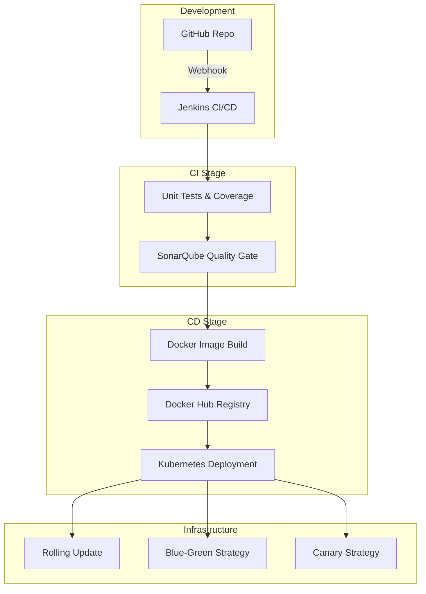

# 🚀 ACEest Fitness & Gym – CI/CD DevOps Assignment – 2

**Name:** Naveen Mupparaju  
**ID Number:** 2024TM93514  
**GitHub Repository:** [https://github.com/naveen1312/aceest-devops-pipeline](https://github.com/naveen1312/aceest-devops-pipeline)

---

## 📌 1. Project Overview
This project implements a **production-grade DevOps pipeline** for the ACEest Fitness & Gym application. It extends the initial prototype by introducing **end-to-end automation, Kubernetes orchestration, advanced release strategies, and strict code quality enforcement**.

**Key Implementation Goals:**
*   **Modular API Architecture**: Versioned endpoints (v1/v2/v3) for iterative feature delivery.
*   **Jenkins CI/CD**: Fully automated pipeline with 9+ stages.
*   **Cloud-Native Deployment**: Kubernetes-based scaling and zero-downtime rollouts.
*   **Quality First**: 80%+ code coverage requirement and SonarQube Quality Gates.

---

## 🏗️ 2. Architecture Overview
The system follows a modern, distributed, and containerized architecture:



---

## 🧑‍💻 3. Application Development (Modular & Versioned)
The application is structured for scale, separating factory logic from routes and data access.

### **Versioned API Strategy:**
*   **v1 (Authentication)**: `/api/v1/login` - Secure login endpoint.
*   **v2 (Membership)**: `/api/v2/membership` - Updated plan and expiry management.
*   **v3 (Booking)**: `/api/v3/bookings` - Modern session reservation system with trainer assignment.

**Directory Structure:**
```text
aceest_app/
├── factory.py      # App Factory pattern
├── routes.py       # Versioned API routes (v1, v2, v3)
├── db.py           # Database orchestration (SQLite)
├── logic.py        # Core fitness analytics logic
└── static/         # Frontend assets
```

---

## 🔁 4. Git Branching & Tagging
We utilize a **Git-Flow inspired branching strategy** to ensure production stability.

*   **`main` branch**: Production-ready code only.
*   **`dev` branch**: Integration branch for pre-production testing.
*   **`feature/*` branches**: Isolated development for specific tasks (e.g., `feature/booking-v3`).
*   **Versioning**: Semantic tagging (e.g., `git tag -a v1.0.0`) is used for every major release.

---

## ⚙️ 5. Jenkins CI/CD Pipeline
The **`Jenkinsfile`** orchestrates the entire lifecycle. It is designed to fail early if quality standards are not met.

**Key Stages:**
1.  **Checkout**: Pulls code and generates a unique `IMAGE_TAG` using the build number and Git hash.
2.  **Lint**: Enforces PEP8 compliance using `flake8`.
3.  **Unit Tests**: Executes 30+ tests with `pytest` and generates `coverage.xml`.
4.  **SonarQube Scan**: Analyzes code smells, bugs, and security vulnerabilities.
5.  **Quality Gate**: Pipeline stops if SonarQube rating drops below 'A'.
6.  **Docker Build**: Creates a production-ready, multi-stage image.
7.  **Deploy To K8s**: Atomically updates the Kubernetes cluster using `kubectl`.

---

## 🐳 6. Containerization (Docker)
The application is packaged using a **multi-stage Dockerfile** to minimize attack surface and image size.

*   **Builder Stage**: Compiles dependencies in a virtual environment.
*   **Production Stage**: Uses `python:3.12-slim`, runs as a **non-root user (`appuser`)**, and serves traffic via **Gunicorn**.
*   **Logging**: Configured to stream Gunicorn logs in **Debug mode** for full observability in Kubernetes.

---

## ☸️ 7. Kubernetes Orchestration
Deployment is managed via declarative YAML manifests located in the `/k8s` directory.

### **Advanced Release Strategies:**
1.  **Rolling Update**: Default strategy with `maxSurge: 1` and `maxUnavailable: 0` for zero-downtime.
2.  **Blue-Green Deployment**: Separate `deployment-blue.yaml` and `deployment-green.yaml` with a service selector switch for safe major upgrades.
3.  **Canary Release**: Uses `canary-ingress.yaml` to route 10% of traffic to the new version for real-world validation.
4.  **Auto-Scaling**: `hpa.yaml` scales pods based on CPU/Memory load.

---

## ⚠️ 8. Challenges & Solutions
*   **Challenge 1: Jenkins Binary Missing**: The Jenkins container lacked `kubectl`. 
    *   *Solution*: Manually side-loaded the `linux/arm64` binary and updated the PATH.
*   **Challenge 2: Resource Quotas**: Cluster limits prevented multiple replicas from starting.
    *   *Solution*: Optimized pod resource requests (`64Mi` requests / `128Mi` limits) to fit within the `mem-cpu-demo` quota.
*   **Challenge 3: PYTHONPATH Imports**: Tests were failing during CI due to import errors.
    *   *Solution*: Standardized the test execution using `PYTHONPATH=. pytest` in the Jenkinsfile.

---

## 🎯 9. Conclusion
This implementation demonstrates a complete, automated DevOps lifecycle. By shifting left on quality (SonarQube) and security (Non-root Docker), and utilizing Kubernetes for high availability, the ACEest Fitness & Gym platform is fully prepared for production-scale traffic.

---
*End of Document*
