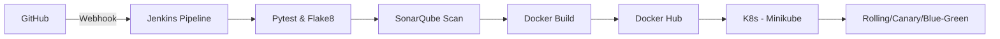

# 🚀 ACEest Fitness & Gym – End-to-End CI/CD Pipeline

[](http://localhost:8085)
[](https://hub.docker.com/r/naveen9871/aceest-app)
[](#)

A production-grade fitness management platform built with **Flask**, containerized with **Docker**, and orchestrated with **Kubernetes**. This repository serves as a complete demonstration of modern DevOps practices, including automated testing, static code analysis (SonarQube), and advanced deployment strategies.

---

## 🌟 Key Features

*   **Modular API Architecture**: Follows the App Factory pattern for scalability.
*   **Versioned API Endpoints**:
    *   `v1/login`: Secure authentication system.
    *   `v2/membership`: Advanced subscription and plan management.
    *   `v3/bookings`: Modern session reservation and trainer assignment.
*   **High Availability**: 3-replica deployment with self-healing capabilities.
*   **Strict Quality Gates**: 80%+ test coverage enforced via SonarQube and Pytest.

---

## 🏗️ Technical Architecture



---

## ⚙️ CI/CD Pipeline (Jenkins)

The `Jenkinsfile` orchestrates a 9-stage pipeline:

1.  **Checkout**: SCM sync and dynamic tagging.
2.  **Install Dependencies**: Virtual environment isolation.
3.  **Lint**: Code style enforcement via `flake8`.
4.  **Unit Tests**: Automated verification via `pytest`.
5.  **SonarQube Scan**: Static analysis for bugs and vulnerabilities.
6.  **Quality Gate**: Automated build failure on low-quality code.
7.  **Build Docker Image**: Multi-stage, optimized production build.
8.  **Push Docker Image**: Registry synchronization to Docker Hub.
9.  **Deploy To K8s**: Atomic rollout to the Kubernetes cluster.

---

## ☸️ Kubernetes Deployment Strategies

The `/k8s` directory contains manifests for multiple release patterns:

*   **Rolling Update**: Default zero-downtime rollout (`deployment.yaml`).
*   **Blue-Green Deployment**: Safe environment switching (`deployment-blue.yaml`, `deployment-green.yaml`).
*   **Canary Release**: Traffic-weighted routing (`canary-ingress.yaml`).
*   **Auto-Scaling**: Horizontal Pod Autoscaler (`hpa.yaml`) for traffic spikes.

---

## 🚀 Quick Start

### 1. Local Development
```bash
python3 -m venv .venv && source .venv/bin/activate
pip install -r requirements.txt
python3 app.py
```

### 2. Docker Execution
```bash
docker build -t aceest-app .
docker run -p 5000:5000 aceest-app
```

### 3. Kubernetes (Minikube)
```bash
kubectl apply -f k8s/service.yaml
kubectl apply -f k8s/deployment.yaml
kubectl port-forward service/aceest-app-service 5000:80
```

---

## 🧪 API Documentation

| Endpoint | Method | Description | Version |
| :--- | :--- | :--- | :--- |
| `/api/v1/login` | `POST` | Member Authentication | `v1` |
| `/api/clients` | `POST` | Create/Register Client | `Base` |
| `/api/v2/membership` | `POST` | Upgrade/Manage Plan | `v2` |
| `/api/v3/bookings` | `POST` | Reserve Fitness Sessions | `v3` |
| `/health` | `GET` | System Health Check | `All` |

---

## 👤 Author
**Naveen Mupparaju**  
*M.Tech - BITS Pilani*  
ID: 2024TM93514  
GitHub: [@naveen9871](https://github.com/naveen9871)
